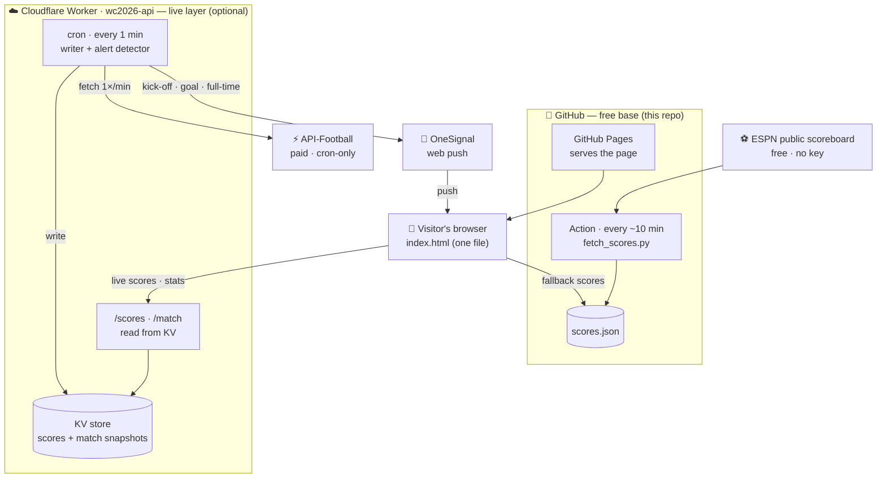

# World Cup 2026 — your-timezone schedule, live scores & one-tap calendar

> Every World Cup I just wanted two simple things: to see when each match kicks off in **my own time zone**, and to add the ones I care about to my **calendar** — without wading through cluttered, ad-heavy sites to piece it together. I couldn't find anything that did just that, cleanly, so I built it. This is that project: a fast, ad-free, no-tracking companion for World Cup 2026. It's a one-person passion project. 🙌

**Live site:** https://danpune.github.io/worldcup2026/

> **🏆 Tournament complete — Spain beat Argentina 1–0 (a.e.t.) in the final at MetLife Stadium, 19 July 2026.**
> The site is now a finished archive: every match, result, bracket, and official highlight stays online,
> but the scheduled jobs that polled live data have been retired (see [Archive mode](#archive-mode)).

A single web page — no build step, no framework, just `index.html` — that you can host for free on GitHub Pages.

## What it does

- 🗓 **Full schedule in your timezone**, with an **Add to Google Calendar** button on every match.
- 📊 **Standings** that recalculate automatically as results come in.
- 🔴 **Live scores** — minute-by-minute during matches, with a LIVE badge and a ticking match clock.
- 📋 **Match detail** — possession, shots, xG and more, plus a **goal/card timeline** and both teams' **starting line-ups**.
- 👥 **Squads** — tap any team (in Standings or on a fixture) to see their full **World Cup roster** grouped by position; upcoming matches have a **Squads** button showing both teams — useful before kickoff, when the official XI isn't out yet.
- ⭐ **Follow your team** — star teams to filter to them and target your alerts.
- 🔔 **Goal alerts** — opt-in push notifications for your teams, with an **Everything / Goals-only** preference.
- 🎬 **Highlights** — every finished match, with an official clip where one's been added or a YouTube search link otherwise, plus a **🎬 Highlights** button right on each finished match card.
- 📜 **All-time head-to-head & history** — tap **H2H** on any group fixture for the teams' past World Cup meetings plus each side's record (appearances, titles, best finish). Pre-baked from a historical dataset, so it adds zero live-API load.
- ↗ **Share cards** — turn a result or matchup into a clean image (Web Share on mobile, download on desktop). Generated in your browser; nothing is uploaded.
- 📺 **Where to watch** — a dedicated tab with the official broadcaster for your country (auto-detected from your time zone, free-to-air channels flagged), curated from FIFA's media-rights list.
- 🌤️ **Per-match weather** — kickoff-time forecast on upcoming matches (Open-Meteo, in-browser, no extra API load).
- 🗣️ **Fan wall** — leave a public comment, no account needed; every submission is held for review and only appears after the admin approves it (rate-limited, link-free, spam-capped).
- 📱 **Installable & fast** — add it to your home screen like an app (web manifest); the page is a single ~58 KB file, so opens are near-instant. No offline cache by design — live scores should never be stale.
- **Ad-free, no accounts, no money handled.** No cross-site tracking, cookies, fingerprinting, or ad networks; the only analytics is [Cloudflare Web Analytics](https://www.cloudflare.com/web-analytics/) — cookieless and aggregate-only (page-view counts, no per-user identifiers).

## How it's built (two layers)

The site is split into a free base anyone can run, and a live layer that runs on the maintainer's own keys.

- **Free base — this repo, fully reproducible.** `index.html` + a small GitHub Action that writes `scores.json`. It needs **no API key**: `fetch_scores.py` reads this project's own public Worker route and [ESPN](https://www.espn.com/)'s public scoreboard, preferring whichever is fresher, and refuses to write a snapshot that would drop an already-finished match. This is what the setup steps below get you: schedule, your-timezone times, calendar buttons, standings, and results.
- **Live layer — optional, runs on 3rd-party accounts.** A **Cloudflare Worker** ([`worker/wc2026-api.js`](worker/wc2026-api.js)) proxies [API-Football](https://www.api-football.com/) for minute-by-minute scores, match stats, the event timeline, line-ups and team squads, and runs a cron job that sends **OneSignal** push alerts. This needs paid/third-party accounts (API-Football, Cloudflare, OneSignal), so it isn't part of the basic clone — see [The live layer](#the-live-layer-optional-advanced).

### Architecture at a glance



**Reading it (decoupled reads):** visitors load the static page from GitHub Pages. Live scores and match detail are served by the Cloudflare Worker **out of KV** — so visitor traffic never calls the upstream API. The Worker's once-a-minute **cron** is the *only* thing that calls the paid API-Football: it writes the latest scores/stats into KV and fires goal alerts via OneSignal. Because reads are decoupled from the paid API, the site can't be rate-limited no matter how many people are watching. If the Worker is ever unavailable, the page falls back to the cached `scores.json` (kept fresh by a GitHub Action).

## Built with

A deliberately lean, **no-framework, no-build-step** stack — and one language (JavaScript) front to back:

| Language | ~Lines | What it builds |
|---|---|---|
| **JavaScript** | ~860 | The entire front-end **and** the Cloudflare Worker backend — vanilla, no framework |
| **CSS** | ~250 | Styling, the green theme, dark mode, responsive layout (inline in `index.html`) |
| **HTML** | ~180 | Page structure — tabs, cards, modals (`index.html`) |
| **Python** | ~390 | Automation: the score fetcher, the health-check monitor, and tests (run by GitHub Actions) |
| **JSON** | — | Data & config: `scores.json`, `highlights.json`, `manifest.json` |
| **YAML** | — | CI/CD workflows + issue templates (`.github/`) |
| **Markdown** | — | Docs (this README, including the diagrams) |

**Stack at a glance:** static HTML/CSS/JS on **GitHub Pages** · a serverless **JavaScript Cloudflare Worker** (cron + KV) · **Python** automation via **GitHub Actions** · **OneSignal** for web push. No frameworks, no build step, no database server — which is what keeps it fast, cheap, and easy to maintain.

## What each file is

| File | What it does | Where it goes |
|---|---|---|
| `index.html` | The web page itself | repo root |
| `scores.json` | The scores the page reads (starts empty; the Action overwrites it) | repo root |
| `fetch_scores.py` | Writes `scores.json` from the Worker feed + ESPN's public scoreboard (no key). Fail-safe: never overwrites good data with an empty or regressed fetch | repo root |
| `update-scores.yml` | The scheduled job that runs the fetcher | **`.github/workflows/update-scores.yml`** |
| `highlights.json` | Optional curated highlight clips for the Highlights tab | repo root |
| `worker/wc2026-api.js` | (Live layer) Cloudflare Worker: live-score/stats proxy + push-alert detector | Cloudflare, not GitHub Pages |
| `OneSignalSDKWorker.js` | (Live layer) OneSignal push service worker | repo root |
| `manifest.json` | PWA manifest (name, icons, theme) so the page is installable | repo root |
| `icon-192.png` / `icon-512.png` | PWA / home-screen app icons | repo root |
| `apple-touch-icon.png` | iOS home-screen icon | repo root |
| `sitemap.xml` | Sitemap for search-engine discovery | repo root |
| `google…html` | Google Search Console verification file | repo root |
| `preview-card.html` / `preview.jpg` | Social/link-preview card and image | repo root |
| `qr.png` | Scannable QR code of the site URL | repo root |
| `test_fetch_scores.py` | Unit tests for the score fetcher | repo root |
| `wc-history.json` | Pre-baked all-time World Cup head-to-head & per-team records (powers the H2H feature) | repo root |
| `build_history.py` | Regenerates `wc-history.json` from the Fjelstul dataset (reproducible, documents provenance) | repo root |
| `html2canvas.min.js` | Vendored library for the in-browser share-card images (loaded only when you tap Share) | repo root |
| `wrangler.toml` / `deploy-worker.yml` | Worker config + GitHub Action that auto-deploys the Worker on push | repo root / **`.github/workflows/`** |
| `healthcheck.py` | Pings the site/Worker/feed and checks API quota — used by the monitoring Action, runnable locally | repo root |
| `healthcheck.yml` | Weekly health-check workflow (alerts + tracking issue on failure; hourly during the tournament) | **`.github/workflows/healthcheck.yml`** |
| `build_history.py` / `build_squads.py` | One-off builders for `wc-history.json` (Fjelstul dataset) and `squads.json` (Wikipedia) | repo root |
| `LICENSE` | MIT license | repo root |

## Run your own copy (the free base, ~10 minutes)

You don't need to write any code, and you don't need an API key — upload these files and turn two switches on.

### 1. Make a GitHub repo
- New repo → name it e.g. `worldcup2026` → **Public** → Create.
- Upload `index.html`, `scores.json`, and `fetch_scores.py` (drag-and-drop on the repo page → Commit).
- Add the workflow: **Add file → Create new file**, and for the filename type exactly:
  `.github/workflows/update-scores.yml` — paste the contents of `update-scores.yml` → Commit.
  (Typing the slashes creates the folders for you.)

### 2. Turn on the page (GitHub Pages)
- **Settings → Pages → Build and deployment → Source: Deploy from a branch → Branch: `main` / `root`** → Save.
- After a minute your page is live at `https://<your-username>.github.io/worldcup2026/`. That's the link you share.

### 3. Run the scores job once
- **Actions** tab → if prompted, enable workflows → pick **Update World Cup scores** → **Run workflow**.
- It runs in ~30s and commits a fresh `scores.json`. **No API key or secret is needed** — the fetcher
  uses public feeds. To poll automatically during a tournament, add a `schedule:` block back to
  `update-scores.yml` (see [Archive mode](#archive-mode)).

Done. Open your Pages link on your phone — flags, your-timezone times, calendar buttons, live standings.

## The live layer (optional, advanced)

Minute-by-minute scores, match stats, the event timeline, line-ups, and push alerts are powered by a Cloudflare Worker rather than the GitHub Action, because they need a paid/real-time feed. Reproducing this requires your own:

- **[API-Football](https://www.api-football.com/) key** (paid plan for World Cup + live data),
- **Cloudflare Worker** running [`worker/wc2026-api.js`](worker/wc2026-api.js) — with the API-Football key, a OneSignal REST key, and an `ADMIN_KEY` (guards the `/testpush` `/run` `/reset` routes) stored as encrypted **secrets** (never in the repo), a **KV** namespace for alert state, and a one-minute **cron trigger**,
- **[OneSignal](https://onesignal.com/) app** (free Hobby plan) for delivering web push.

The page automatically falls back to the committed `scores.json` if the Worker isn't configured, so the base site works fine without any of this. The Worker file is documented at the top of [`worker/wc2026-api.js`](worker/wc2026-api.js).

## Highlights

The **Highlights** tab lists every **finished** match (newest first) automatically — no upkeep needed. By default each match links out to a YouTube search for that fixture's highlights.

To upgrade a match to an **embedded clip**, add its official video to `highlights.json`: grab the official FIFA / FIFA+ YouTube video, copy its **video ID** (the part after `watch?v=` in the URL), and add an entry keyed by the match number:

```json
"highlights": {
  "1": {"yt": "VIDEO_ID_HERE"},
  "2": {"yt": "ANOTHER_VIDEO_ID"}
}
```

Commit/push and that match shows the embedded clip instead of the search link. Availability depends on the video's region settings — some clips are geo-restricted by broadcast rights, which the page can't change.

## How "live" works
- The free base fetches **final and in-play** group scores; finals feed the standings, in-play games show a **LIVE** badge but only count once full-time. The live layer adds minute-by-minute updates and a ticking clock.
- The bar at the top of the Schedule and Standings tabs shows the source and **when it last updated**.
- Scores are **read-only** — they come straight from the feed; there's no manual editing. If a feed is ever down, the job never overwrites a good `scores.json` with a failed fetch, so the last known scores stay put.

## Good to know / troubleshooting
- **Refresh cadence (free base):** the schedule is currently off (see [Archive mode](#archive-mode)); during a tournament a `*/10 * * * *` cron in `update-scores.yml` was the sweet spot. GitHub's scheduler can add a few minutes' delay under load.
- **403 / no data:** ESPN rate-limits datacentre IPs and can start returning 403 to CI runners if you poll hard — that is exactly why `fetch_scores.py` refuses to write a snapshot that drops already-finished matches. Don't poll more often than every ~10 min.
- **Knockout scores:** the standings are group-stage (that's where a points table applies). Knockout team names appear once decided; auto-scoring those is a later add-on.
- **Hosting elsewhere:** you can serve the page on Netlify instead, but keep the repo on GitHub so the Action can write `scores.json`. GitHub Pages is simplest because it's all in one place.

## Monitoring & health
- **Weekly health check** (hourly during the tournament) — [`healthcheck.py`](healthcheck.py), run by [`.github/workflows/healthcheck.yml`](.github/workflows/healthcheck.yml), verifies the site is up, the Worker is up and serving scores, the admin routes are still locked, the API-Football plan/quota is healthy, and `scores.json` is fresh. On a hard failure it fails the run (GitHub emails the owner) and opens/updates a `[health]` tracking issue. Run it yourself any time: `python3 healthcheck.py`.
- **Worker errors** — the Worker `console.log`s detector failures and a privacy-safe client error beacon (`/log`); view them in the Cloudflare dashboard (**Workers → Observability → Logs**) or live with `wrangler tail`.
- **Uptime** — for instant outage alerts, point a free uptime monitor (e.g. UptimeRobot) at the site URL and the Worker's `/scores`.
- **Error beacon** — the page reports anonymous JS errors (message + source line + browser only — no IP, no identifiers, no third-party tracker) to the Worker `/log` route, so real user-facing bugs can be triaged from the Cloudflare logs.

## Archive mode

The tournament finished on **19 July 2026**, so every scheduled job has been switched off and the
site is served as a static archive. Nothing polls, nothing writes, and nothing can silently change
the recorded results.

| What | Was | Now |
|---|---|---|
| `update-scores.yml` | `*/10 * * * *` cron | `workflow_dispatch` only |
| `wrangler.toml` (Worker cron) | `* * * * *` | `crons = []` |
| `healthcheck.yml` | hourly | weekly |

**Why it matters:** on 6 August 2026 the still-running score cron met an ESPN 403 (they block
datacentre IPs), fell back to the Worker's snapshot — frozen since the API-Football plan lapsed on
14 July — and rewrote `scores.json` *without* matches 101–104, erasing both semifinals, the
third-place play-off and the final from the live site. The churn also caused rebase conflicts and
queue-cancelled Action runs. `fetch_scores.py` now refuses any write that would drop a match already
recorded as finished, and the schedules are off.

**To revive it for another tournament:** restore the `schedule:` block in
[`update-scores.yml`](.github/workflows/update-scores.yml) and `crons` in
[`wrangler.toml`](wrangler.toml). Both files carry comments explaining exactly what to put back.

## Sources & credits
- **Official (source of truth):** FIFA — https://www.fifa.com/en/tournaments/mens/worldcup/canadamexicousa2026
- **Live scores & stats:** [API-Football](https://www.api-football.com/) (live layer, paid — the plan was retired on 14 July 2026) and [ESPN](https://www.espn.com/)'s public scoreboard (free base, no key). Both unofficial; FIFA is the source of truth.
- **Schedule curated from:** NBC Sports, cross-checked against World Cup Wiki and FIFA host-city sites (Dallas, NY/NJ, Atlanta).
- **TV (USA):** FOX Sports — https://www.foxsports.com/soccer/fifa-world-cup
- **Historical World Cup data (head-to-head & records):** The Fjelstul World Cup Database — [github.com/jfjelstul/worldcup](https://github.com/jfjelstul/worldcup), © Joshua C. Fjelstul, Ph.D., licensed [CC-BY-SA 4.0](https://creativecommons.org/licenses/by-sa/4.0/). The derived `wc-history.json` is likewise CC-BY-SA 4.0.
- **Share-card rendering:** [html2canvas](https://html2canvas.hertzen.com/) (MIT), vendored locally.

Not affiliated with FIFA. For official confirmation of any result, check fifa.com.

## License

Code is [MIT-licensed](LICENSE). Match data comes from the public sources
credited above and stays subject to their terms.
